# CharityChatApp
This is extension of CharityApp - a Chat App

Final report: [Google Drive](https://drive.google.com/file/d/1zlAzVJDBiratsejEa0uqA8GiuPXskA8o/view?usp=sharing)

UI Design: [Figma](https://www.figma.com/file/75RUeQaqduNmFV5eyqAoqb/%C4%90%E1%BB%92-%C3%81N-1?node-id=1592%3A2812)

## **About team**

The project have 2 member:
- [Vũ Ngọc Thạch](https://github.com/vungocthach) - MSSV: 19520266
- [Huỳnh Thị Minh Nhực](https://github.com/HuynhThiMinhNhuc) - MSSV: 19521973

Some UI:

**Login**

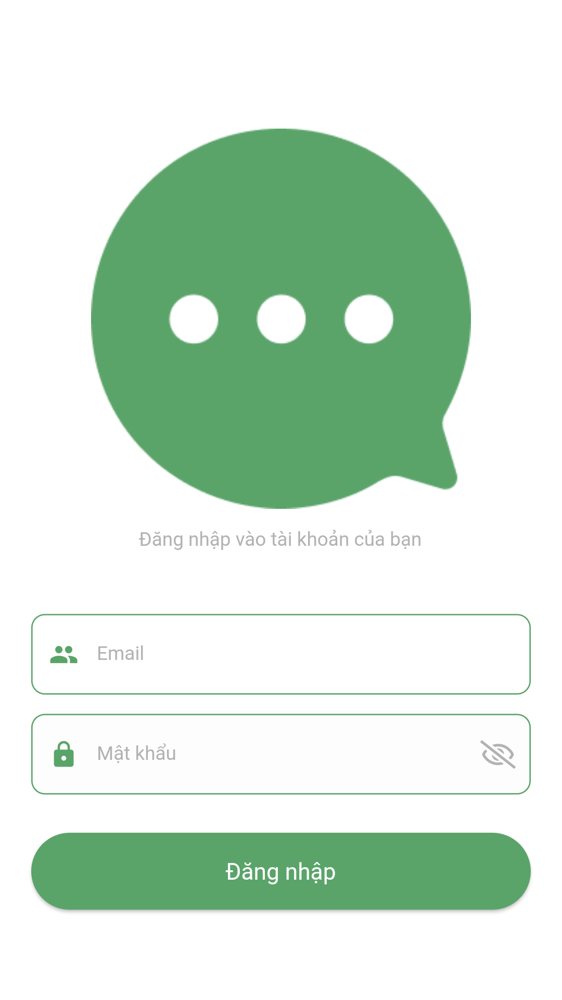

**Home**

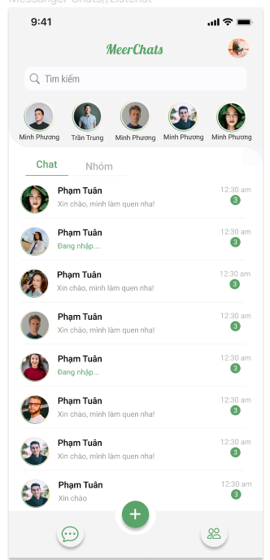

**Chat**

<table>
    <td>
        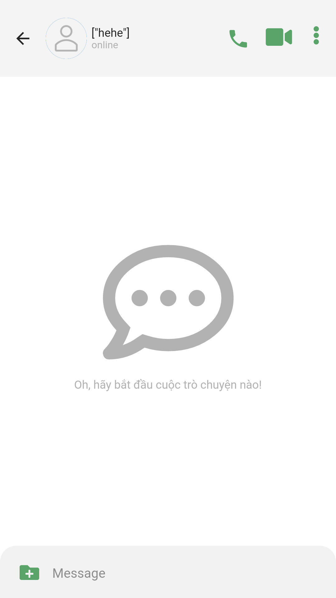
    </td>
    <td>
        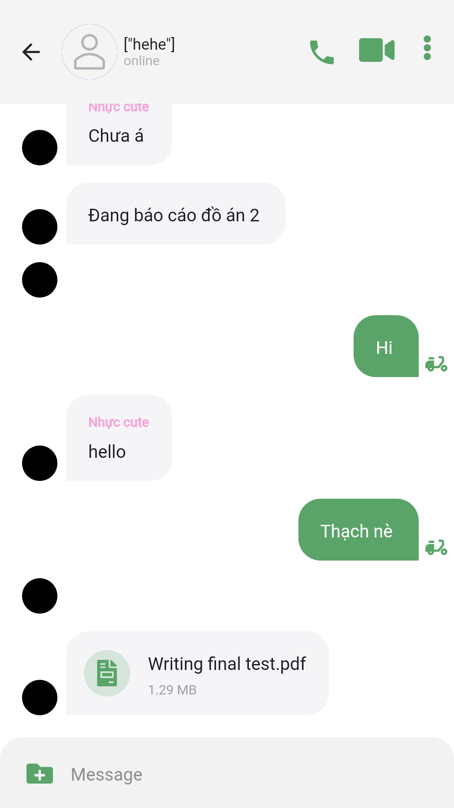
    </td>
    <td>
        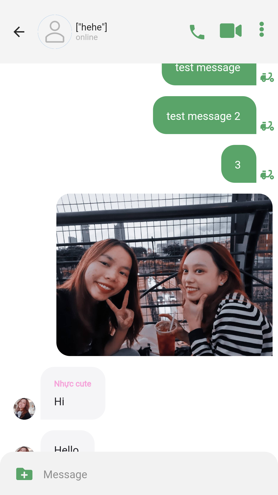
    </td>
</table>

**Call video**

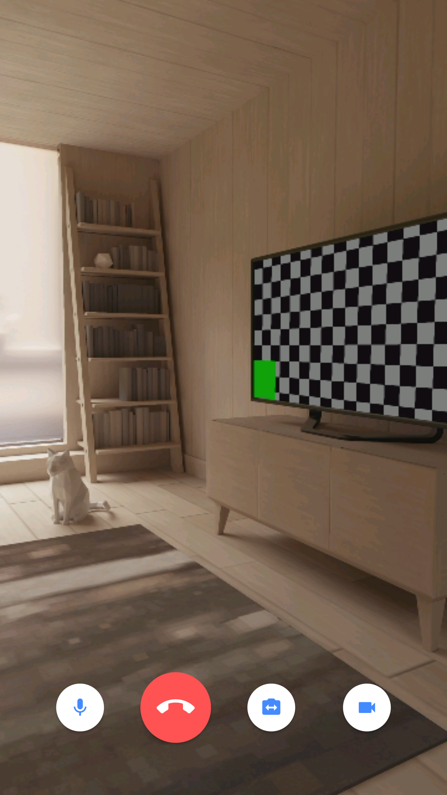

**Setting Chat**

<table>
    <td>
        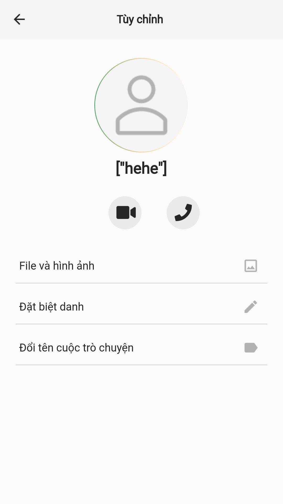
    </td>
    <td>
        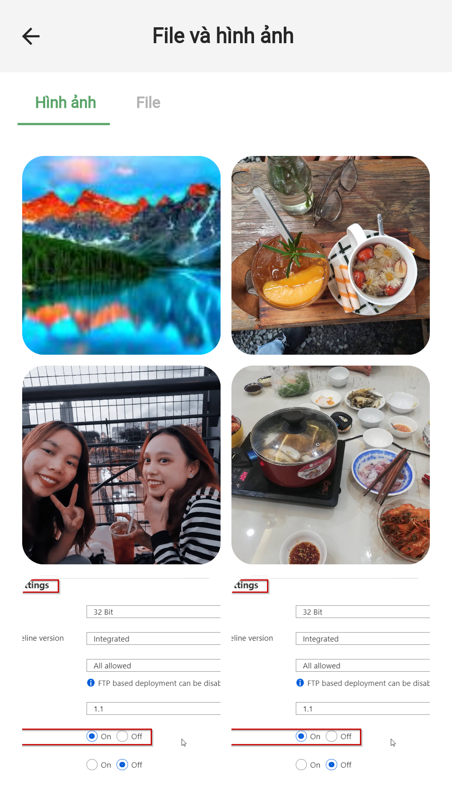
    </td>
    <td>
        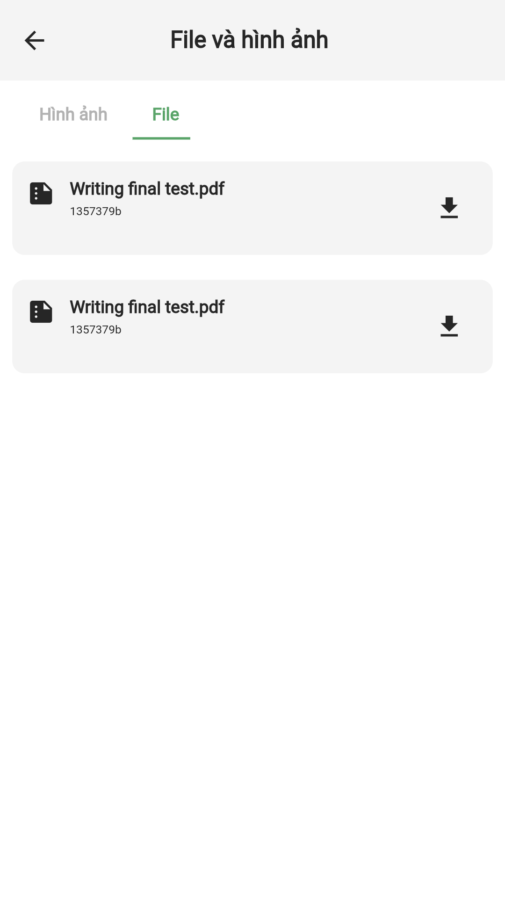
    </td>
</table>

**Add New Group Chat**

<table>
    <td>
        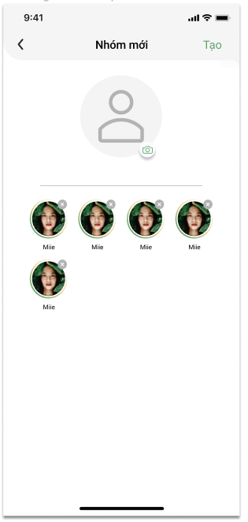
    </td>
    <td>
        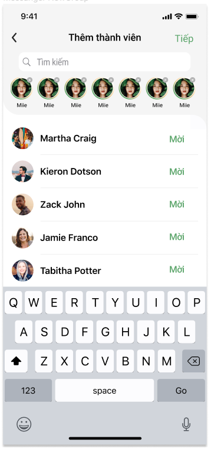
    </td>
</table>

**Setting**

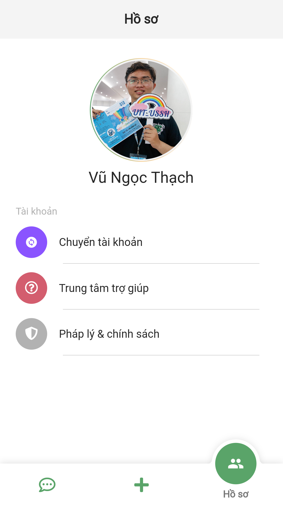
